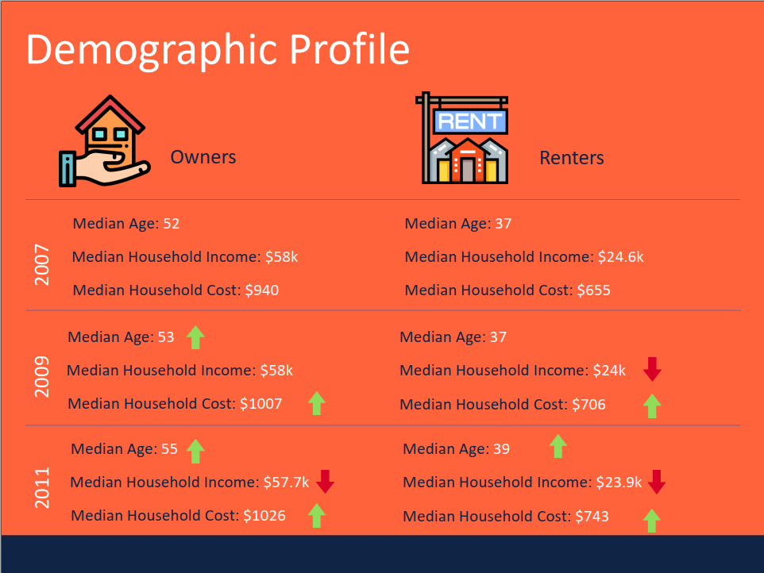
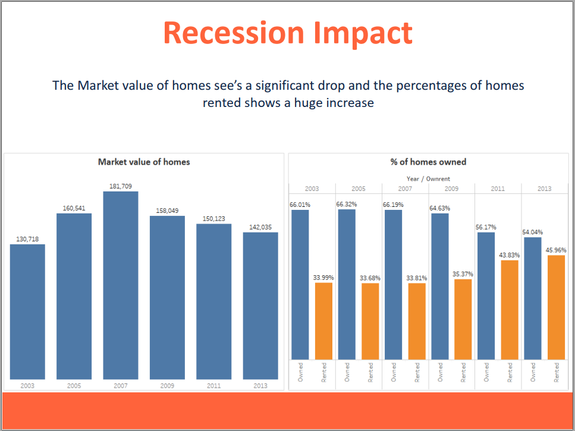
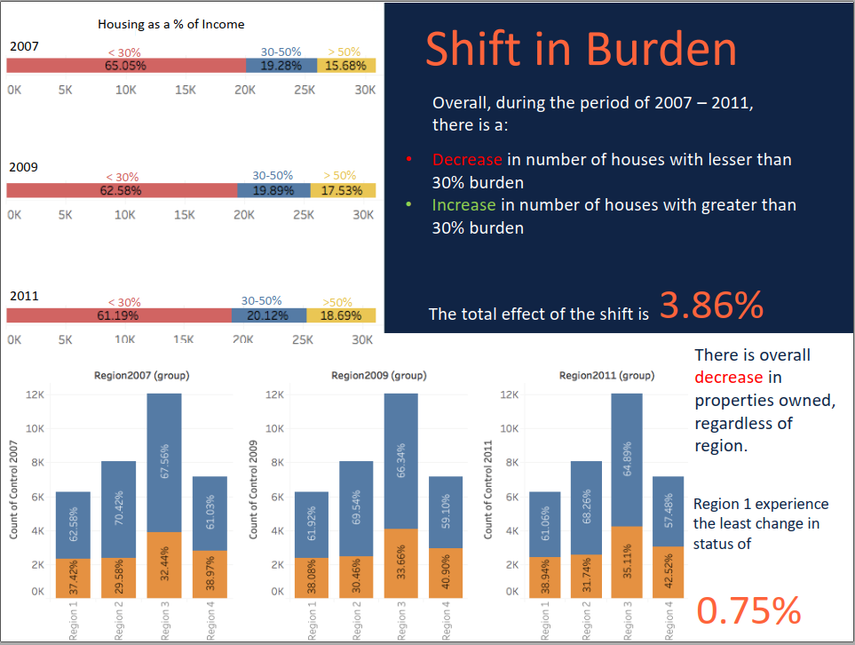

# US Housing Price Analysis
> An analysis of the housing and rent prices in the United States before and after the 2008 Housing Bubble.
The project was completed in 6 hours as part of final Hackathon Round of Intelligence Analytics Challenge 3.0 at the University of Texas at Dallas. 
The entire summary of the project can be found in the [project report](https://github.com/harshbg/US-Housing-Price-Analysis/blob/master/Team_Random%20-%20Final.pdf).

## Table of contents
* [General info](#general-info)
* [Screenshots](#screenshots)
* [Technologies and Tools](#technologies-and-tools)
* [Setup](#setup)
* [Features](#features)
* [Status](#status)
* [Contact](#contact)

## General info
The data-set consists of details about variour houses across and its ownership status across United States from the year 2003-2013 for every alternate year. The data has been used to answer various questions related to the US housing market. 

## Screenshots

**The entire presentation of the project can be found [here](https://github.com/harshbg/US-Housing-Price-Analysis/blob/master/Team_Random%20-%20Final.pdf).**

## Technologies and Tools

* Microsoft R -version 3.4.3
* Tableau - version 10.5
* Microsoft Excel

## Setup
The data used for exploratory analysis and model building can be found [here](https://github.com/harshbg/US-Housing-Price-Analysis/tree/master/Data). The visualizations can be replicated using Tableau. 

## Features
* Visualized housing and renting prices across America using Tableau to understand impacts of the housing bubble.
* Derived yearly trend for house prices for various locations and illustrated regions with profitable housing property.
* Determined the impact of poverty on house ownership, debt burden, and occupancy of people in a room.

## Status
Project is: _finished_ and we did win the second position if the analytics challange. 
Our project for the previous round can be found [here](https://github.com/harshbg/US-Consumer-Time-Spend-Analysis). Be sure to check it out. 

## Contact
Created by me and my awesome teammates Weiyang Sun and Sri Harish Popuri **Team Random**
If you loved what you read here and feel like we can collaborate to produce some exciting stuff, or if you
just want to shoot a question, please feel free to connect with me on <a href="hello@gupta-harsh.com" target="_blank">email</a>, <a href="https://www.linkedin.com/in/harshbg/" target="_blank">LinkedIn</a>, or <a href="https://twitter.com/harshbg" target="_blank">Twitter</a>. My other projects can be found [here](http://www.gupta-harsh.com/projects/).
